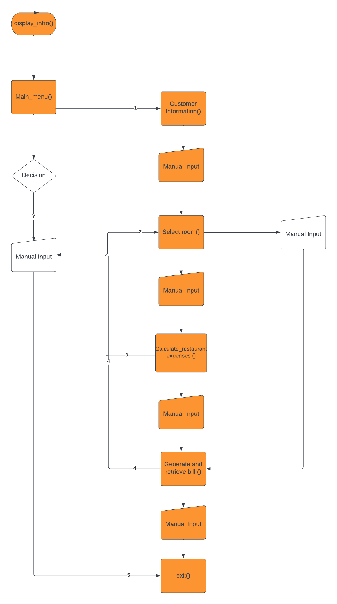
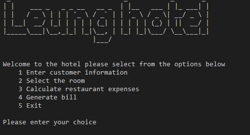
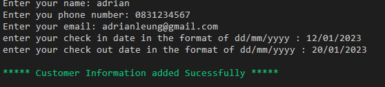
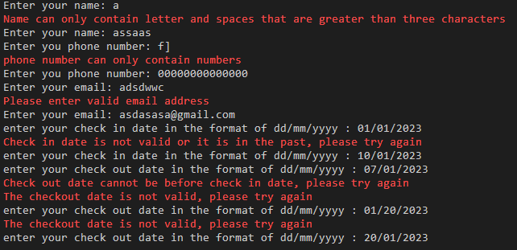
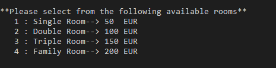
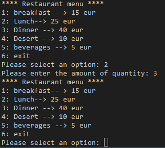
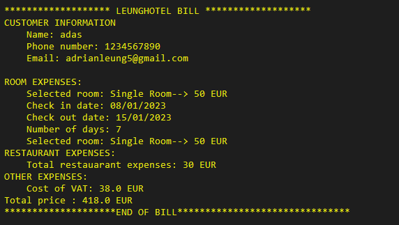
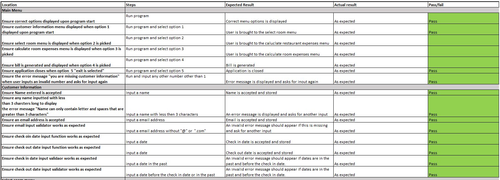
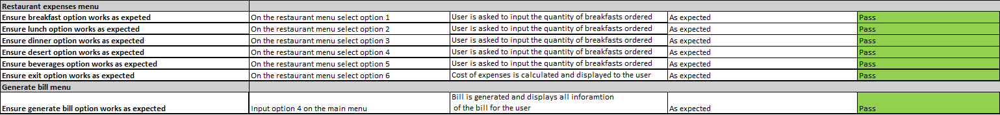

## Introduction

This project was created in order for hotels to easily calcualte and track the expenses hotel guests spend during their vists in hotels

### Target Audience

* Hotel management/ receptionist who handles the cost of staying in the hotel for guests

### User Stories

* As a User, I would like to be able to easily store various guest infomration with ease.
* As a User, I would like to be able to differentiate the different costs for customers during their stay. Such as restaurant expenses and room expenses.
* As a User, I would like to be able to easily the determine the cost of the room the customers have used
* As a User, I would like to be able to return to the main menu without having to restart the application.
* As a user, I would like to be able to generate a bill for customers to enable them to see the costs during their stay.

### Features Planned

* Simple, easy to use application with clear navigation.
* Ability to store customer information such as name, addresss, and dates of their vist
* Ability to calculate the price of the room during the customers stay.
* Ability to calculate restaurant expenses during the their stay.
* Ability to calculate the total price of stay.
* Generate a bill for guests

**Error Handling**

Error handling was implemented throughout the application with the use of try/except statements to handle exceptions raised for things like, None type values and Value errors.

## Flow Chart





### Features


IMPLEMENTATION
* Bill Menu
    * When the application starts, you will get a welcome message with a main menu with the following options:
    * 1 - Enter customer information
    * 2 - Select the room
    * 3 - Calculate restaurant expenses
    * 4 - Generate bill
    * 5 - Retrieve room for bill
    * 6 - Remove bill for room
    * 7 - Enable the user to exit the application
    * The user must input a correct number corresponding to each menu or they will be alerted of an inccorect choice and the menu will be presented again.

    
    


 * Customer information Menu
    * When customer information menu has been selected, the following menu options appear:
    * Enter your customer name - This will enables users to input and store customers name.
    * A error message will appear in red if users type names with less than 3 message
    * Enter phone number - This will allow the users to input their and store customer phone numbers.
    * A warning message will appear if customers enter charcters here and enter numbers with less than 10 digits.
    * Enter your email - This will allow the users to enter and store their customer email.
    * A error message will appear if users do not enter a emmail with an "@" and ".com".
    * Enter check in date - This option will enable users to enter customer check in date during their stay.
    * A error message will appear when you type an invalid date or a date in the past.
    * Enter check out date - This option will return the user to enter customer checkout date during their.
      A error message will appear when you type an invalid date or a date before the check in date.
    * Total room price - This will be calculated and displayed to the user based on the number of days and type of room.
   

      

      


 * Selecting room Menu
    * Single room - 50 eur
    * Double room - 100 eur
    * Triple room - 150 eur
    * Family room - 200 eur


   

   Total room price
 * This will be displayed to the user once the user 
 as selected a room. It is calculted based on length of stay multiplied by the type of room.
 * Once the room price is generated the user will have a choice to skip restaurant expenses and generate the bill or add restuarant expenses.

 

 * Restaurant Menu
    * 1 Breakfast - 15 eur
    * 2 Lunch - 25 eur
    * 3 Dinner - 40 eur
    * 4 Beverages - 25 eur
    * 5 Exit
* Total restaurant cost
    * This will be displayed to the user once the user has entered the number of meals they have had.

   

* Generate bill
   * This will generate the bill with the information for all of the customers expenses.
   * Users will then have an option to return to the main menu or leave the application.
   * Once the bill is generated, the user will also have the option continue to add another customer via main menu or exit the application.

   
   


### Features Left to Implement

As a future enhancement, I would like to add some functionanality to edit room bookings. I would also like to add a feature to retrieve a bill based on a customers name.


### Technologies

* Python - Python was the main language used to build the application.
   Python - Python was the main language used to build the application.
    * Python packages used:
        * Re - Used to validate email in put
        * [Gspread](https://docs.gspread.org/en/v5.7.0/) was used for Google Sheets.
        * [Pyfiglet](https://pypi.org/project/pyfiglet/0.7/) was used to create the design of the main menu  
        * [Datetime]](https://www.w3schools.com/python/python_datetime.asp) was used to input date data.

* [Pyfiglet](https://pypi.org/project/pyfiglet/0.7/) was used to create the design of the main menu 
* [LucidCharts](https://www.lucidchart.com/) was used to create the UML Case Diagram, Class Diagram and the Flowchart.
* [Google Drive](https://drive.google.com/) and [Google sheets API](https://developers.google.com/sheets/api) 
    was connected, so data can be collected and stored on Google spreadhseet.
* [Re](https://www.w3schools.com/python/python_regex.asp) was used to validate the input for customers email information.


 ## Testing

 * Below are the test execution of positive functional tests:






 * Negative input validation testing was performed on all menu options to ensure correct input. All options behaved as expected, alerting the user of invalid inoput and then asking for input again.


 ### Pep8 Validation


 ## Deployment

 ### Version control

The following git commands were used throughout development to push code to the remote repo:

- ```git add <file>``` - was used to add the file(s) to the staging area before they are committed.

- ```git commit -m “commit message”``` - was used to commit changes to the local repository queue ready for the final step.

### Unresolved bugs
- Color of application turns red when invalid inputs are entered continously.

## Deployment

The site was deployed to Github pages
- Navitgate to the settings tab of the Github repository via [Github repository](https://github.com/adrianleung5/Leung-Wellness).
- Select pages tab on the left side of the page under code and automation.
- Under source, select "deploy from a branch" and then click ‘save’.
- Page will refresh, Return to the repository page and you will a "github-pages active" icon under enviornment on the right side of the page.
- A live link can be found here 

### To Fork the Repository
- Go into Github and select the fork icon on the top right.
- When you have pressed the fork button you should now have a full copy of the repository.

### Create a local clone
- Log into Github and go to the repository. Click on the ‘code’ tab beside the gitpod button.
- Select the clipboard icon
- In your IED open GitBash
- Change the current working directory to the location you want the cloned directory to be made.
- Type ‘git clone’ and then paste the URL copied from GitHub.
- press enter and the local clone will be created.

## Credits

### Content
- [Gareth-Mcgirr rental management](https://github.com/Gareth-McGirr/motorcycle-rental-management#Technologies) inspired this booking system and README 
- [Pyfiglet](https://pypi.org/project/pyfiglet/0.7/) was used to create the design of the main menu  
- [Google Drive](https://drive.google.com/) and [Google sheets API](https://developers.google.com/sheets/api)   

### Code
- I found a lot of useful tutorials online. I occasionally applied principles from them to the site after thoroughly understanding their code and modifying it to meet the needs of the site.
- [Stack Overflow](https://stackoverflow.com/questions/69960172/how-to-make-a-bill-by-python) was used to generate the bill
- [Stack Overflow](https://stackoverflow.com/questions/287871/how-do-i-print-colored-text-to-the-terminal) was used to add colors to the bill
- [W3schools](https://www.w3schools.com/) was used to , research various python syntax
- [GeeksforGeeks](https://www.geeksforgeeks.org/movie-tickets-booking-management-system-in-python/) was used to understand how to design the booking system
- [GeeksforGeeks](https://www.geeksforgeeks.org/check-if-email-address-valid-or-not-in-python/) was used to validate the email input.
- [GeeksforGeeks](https://stackoverflow.com/questions/16135069/how-do-i-validate-a-mobile-number-using-python) was used to validate the phone number input.
- [Datetime]](https://www.w3schools.com/python/python_datetime.asp) was used to input date data.


